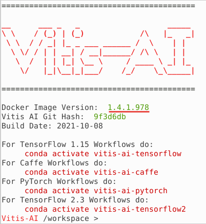

# Running a pre-built example on Amazon AWS F1

In this lab you will use a pre-built TensorFlow framework supported model to validate installation on the F1 instance that has a Xilinx FPGA board.

You should have an instance with the docker image installed and Vitis-AI 1.4.1 Git repository cloned. If not done, then refer to [AWS_README](./setup_vitisai_awsf1.md).

Open a terminal window after logging in into the instance.

You can download model files (board specific pre-compiled or board independent source files) to run the available `downloader.py` located in `Vitis-AI_1_4_1/models/AI-Model-Zoo` directory.

Execute the following commands to download the U200 specific pre-compiled files:

```sh
cd
cd Vitis-AI_1_4_1/models/AI-Model-Zoo/
python3 downloader.py
```
You will see output like:


Type `tf inceptionv1` and hit Enter. The available selections will be displayed.


Note `1` is for the board independent source files, `7` is for the U200 specific compiled files, `2` to `6` are for the other boards specific options.

Type `7` and hit Enter to download the tar file (inception_v1_tf-u200-u250-r1.4.0.tar.gz). Extract the downloaded file to get `inception_v1_tf` directory and associated files.
```
tar -xvf inception_v1_tf-u200-u250-r1.4.0.tar.gz
```

## Launch Docker Container
Start the docker image by executing the following commands:

```sh
cd
cd Vitis-AI_1_4_1
./docker_run.sh xilinx/vitis-ai-cpu:1.4.1.978
```

Hit the enter key six times until you see a message to agree to the terms. Press `y` and hit enter to download the docker files. It may take few minutes to download the image during the first invocation. You will see the docker shell:



Activate conda for TensorFlow.

```sh
conda activate vitis-ai-tensorflow
```
Note that the docker shell's command prompt indicates that the `tensorflow` is activated.

```console
(vitis-ai-tensorflow) Vitis-AI /workspace>
```

Note that `/workspace` of docker image maps to the `/home/ubuntu/Vitis-AI_1_4_1` directory in the Ubuntu terminal.

Change the directory to go to the untared directory.

```sh
cd ./models/AI-Model-Zoo/inception_v1_tf
```

Note the three files provided:

`inception_v1_tf.prototxt  inception_v1_tf.xmodel  md5sum.txt`.

The `inception_v1_tf.xmodel` is the compiled model for the *DPUCADF8H* DPU.

Copy the necessary source files directory (`src`), a shell script to build the project (`build.sh`), and `words.txt` which describes various objects labels from the example directory provided as part of the repository. Finally, build the project.

```sh
cp -r ../../../examples/DPUCADF8H/tf_inception_v1/* .
./build.sh
```

The `build.sh` script will compile the source files and generate the `inception_example` executable.

Download a minimal validation set for [Imagenet2012](http://www.image-net.org/challenges/LSVRC/2012) using [Collective Knowledge (CK)](https://github.com/ctuning) by executing the following commands:
> **Note:** User is responsible for the use of the downloaded content and compliance with any copyright licenses.

```sh
mkdir image
python -m ck pull repo:ck-env
python -m ck install package:imagenet-2012-val-min
python -m ck install package:imagenet-2012-aux --tags=from.berkeley
head -n 500 ~/CK-TOOLS/dataset-imagenet-ilsvrc2012-aux-from.berkeley/val.txt > ./image/val.txt
cp ~/CK-TOOLS/dataset-imagenet-ilsvrc2012-val-min/*.JPEG image/.
```
Note that `~` is the home directory of the docker image which maps to `/home/vitis-ai-user/`.

Source the DPU xclbin.

```sh
source /workspace/setup/alveo/setup.sh DPUCADF8H
```

After sourcing the `setup.sh` in the above command, you should see the `XCLBIN_PATH` and `XLNX_VART_FIRMWARE` defined.

```console
XCLBIN_PATH = /opt/xilinx/overlaybins/DPUCADF8H
XLNX_VART_FIRMWARE = /opt/xilinx/overlaybins/DPUCADF8H/dpu-aws.xclbin
```

Run the `inception_example` application with the compiled model and the validation set by executing the following command:

```sh
./inception_example  inception_v1_tf.xmodel ./image
```

The compiled model will be loaded in the DPU and the application will run in hardware generating output like:

```console
Image : ILSVRC2012_val_00000498.JPEG
top[0] prob = 0.544102  name = common newt, Triturus vulgaris
top[1] prob = 0.094551  name = centipede
top[2] prob = 0.064984  name = eft
top[3] prob = 0.023906  name = spotted salamander, Ambystoma maculatum
top[4] prob = 0.014500  name = European fire salamander, Salamandra salamandra

Image : ILSVRC2012_val_00000237.JPEG
top[0] prob = 0.450742  name = English foxhound
top[1] prob = 0.351039  name = Walker hound, Walker foxhound
top[2] prob = 0.047508  name = Great Dane
top[3] prob = 0.028815  name = English setter
top[4] prob = 0.012012  name = German short-haired pointer

Image : ILSVRC2012_val_00000073.JPEG
top[0] prob = 0.290455  name = kite
top[1] prob = 0.176170  name = sulphur-crested cockatoo, Kakatoe galerita, Cacatua galerita
top[2] prob = 0.106852  name = vulture
top[3] prob = 0.044543  name = papillon
top[4] prob = 0.034690  name = bald eagle, American eagle, Haliaeetus leucocephalus
```

The output shows the image file that is being evaluated and top five probabilities of the classification. The names are derived from `val.txt` file which is part of the downloaded validation set in the `image` directory.

You may want to close the docker image by typing `exit` in the image console.

Now that we have verified that we can execute the application in hardware, we can explore first framework example.

- [TensorFlow Lab using InceptionV1 model](./tf_inceptionv1.md).

---------------------------------------
<p align="center">Copyright&copy; 2022 Advanced Micro Devices, Inc</p>